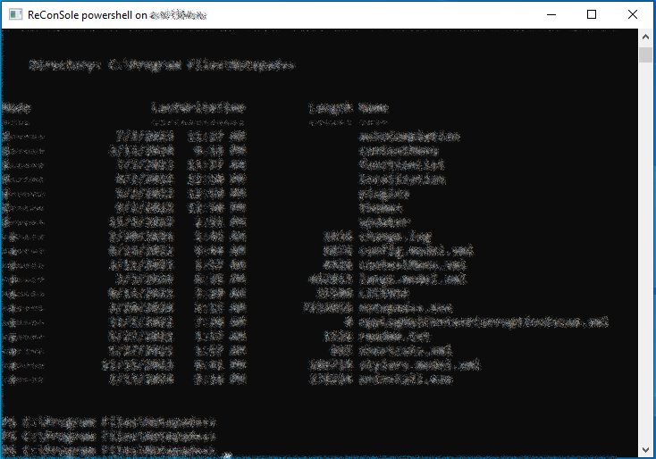
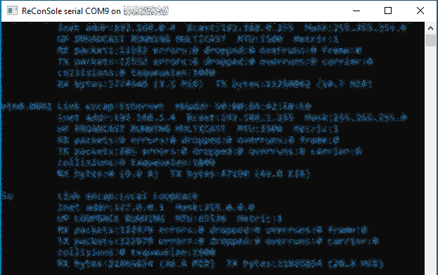

# ReCon
Remote Connector aka "ReCon" is a GUI based tool (for windows on local/remote at the moment) used to connect to IP enabled devices attached to a remote system.

## Description
If you're a developer, tester, or network engineer working home office, you're likely to have a server physically located in your work area and attached devices to it.
Interacting those devices via any means like serial or IP communication often requires opening a remote desktop session first and then using relevant applications on a RDP session.
<p>
Instead of this method, you can interact those devices as if they are besides you with SSH and serial tunnels. So you can use them without opening a RDP session.
## Installation
To install the application, follow the steps below:
  
### Prerequisites
#### Local system
- Python 3.x installed. (tested with 3.10)
- openssh client installed.
- pip package manager installed. (It usually comes bundled with Python.)
- Internet connection to install dependencies.
#### Remote system
- openssh server in the remote system that supports:
  - password authentication
  - port forwarding
- putty (or just plink) in the remote system.

### Steps
1. Clone the repository or download the source code.
```git clone <repository_url>```
2. Navigate to the project directory
```cd <project_directory>```
3. Start the application by:
- For Windows: ```recon```
- For Linux: Not supported yet.

## Visuals
### Splash Screen


The field labels are self explaining. This is the panel to be used for authenticating to ssh server running on remote PC.
If any problem occurs during connection attempt, error details will be reported in the bottom right status bar.

### Remote Screen


Description of the fields:
1. Spawn Shell: This will spawn a shell on the remote system.
2. Consoles: After the first connection established to the remote system, serial consoles of the remote system are scanned and they are listed here. The listing is saved to cache for the further sessions.
3. Refresh Consoles: This will rescan the serial consoles of the remote system.
4. Spawn: This will spawn the selected serial console on the remote system.
5. Local Networks: After the first connection established to the remote system, local networks of the remote system are scanned and they are listed here. The listing is saved to cache for the further sessions.
6. Refresh Local Networks: This will rescan the local networks of the remote system.
7. Found nodes: After the first connection established to the remote system, the selected local network will be scanned for possible live nodes. Since this may take some while, a confirmation is asked to user. If accepted, ping scanning will be started and responding IP addresses will be added to the list. The listing is saved to cache for the further sessions.


8. Node: A node found during scan will be represented in the listbox.
9. Refresh nodes: This will rescan the local network of the remote system for possible live nodes.
10. Tunnel HTTPs/Close Tunnel: By default this button has caption "Tunnel HTTPs". When clicked, it will create a SSH tunnel including port forwardings from a local random available port to the node:443. After this tunnel is established, double clicking to a node in the list will redirect user to the default browser with the address https://localhost:local_port. While there an active SSH tunnel, button caption will be "Close Tunnel" and it will close the tunnel.
### Spawned Command Shell
The spawned serial console window looks like as the following. It can be closed with window closing button or "exit" command.


### Spawned Serial Console
The spawned serial console window looks like as the following. It can be closed with window closing button or CTRL+C.


## Contact
For problems, ideas, discussions etc. You may contact me at aliakyurek@gmail.com
## Roadmap
* Customizable tunnels instead of default 443 tunneling
* Stopping node scanning
* Adding nodes manually
* Key based authentication
* Linux support on
  * client
  * remote 
## Contributing
If you have something, PRs are welcome.
## Authors and acknowledgment
## License
MIT
